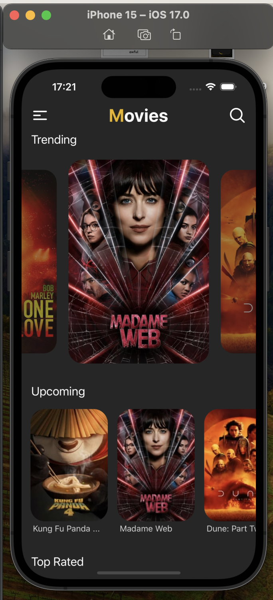
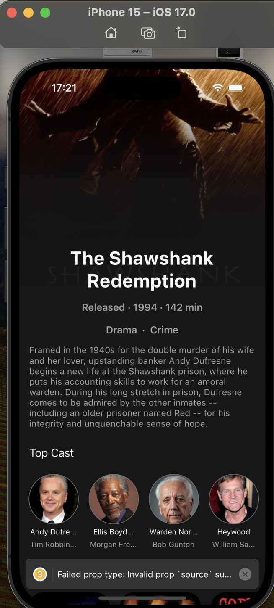
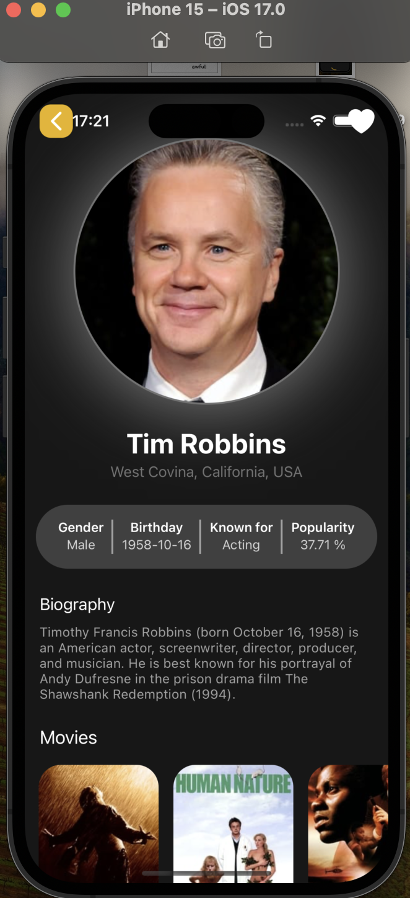

# Movie App Template

The Movie App Template is a starting point for developers looking to build a movie information application. It provides a rich UI to display trending, upcoming, and top-rated movies. Users can search for movies by name, view detailed information about each movie, and see a cast of actors. This template uses the TMDB movies database to show data.

## Features

- **Search Functionality**: Users can search for movies by name.
- **Movie Categories**: Explore different categories like Trending, Upcoming, and Top Rated movies.
- **Detailed Movie Info**: Each movie page shows detailed information, including a cast of actors.
- **Actor Profiles**: Users can view profiles of actors and actresses, including their filmography.
- **Responsive UI**: Optimized for both iOS and Android devices.

## Getting Started

To get started with the Movie App Template:

1. **Clone the Repository**: Clone this project to your local machine using Git.
2. **Install Dependencies**: Run `npm install` or `yarn install` to install the necessary dependencies.
3. **Run the App**: Use `expo start` to run the app on your preferred platform via Expo Go, or build the app for iOS or Android.

## Usage

This app is a template and not a complete solution. It's designed to be a starting point for your project:

1. Explore different movie categories on the home screen.
2. Use the search bar to find specific movies.
3. Select a movie to view more details and the list of actors.
4. Tap on an actor to view their profile and other movies they've starred in.

## Screenshots

Here are some screenshots showcasing the app:

## Demo Video

</a>

## Contributing

Contributions to this template are welcome. Feel free to fork the repository and submit your pull requests.

## Feedback

If you have any feedback or suggestions for this template, please open an issue in the repository.
